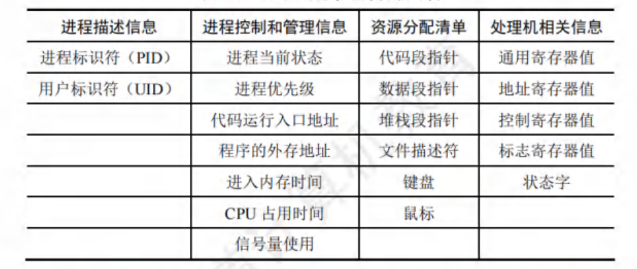

# 操作系统

## 计算机系统概述

### 操作系统的基本概念

1. **操作系统的概念**

    操作系统是指**控制和管理**整个计算机系统**硬件和软件资源**，合理组织调度计算机的**工作与资源分配**，为用户提供方便的接口与环境的**程序的集合**

2. **操作系统的特征**

    1. **并发**：两个或多个事件，在同一时间间隔内发生
        1. 并行是在同一时间上进行的操作
        2. 并发是同一个时间段内交替操作，宏观上看起来是同时执行的
    2. **共享**
        1. 互斥共享
        2. 同时访问
    3. **虚拟**：将一个物理实体变为若干逻辑上的对应物
        1. 时分复用技术：虚拟处理器
        2. 空分复用技术：虚拟存储器
        3. 虚拟设备技术：虚拟IO设备
    4. **异步**：允许多个程序并发执行，但是资源有限，进程不是一贯到底的，走走停停

3. **操作系统的目标和功能**

    1. 操作系统是计算机系统的资源管理者
        1. 进程管理
        2. 内存管理
        3. 文件管理
        4. 设备管理
    2. 操作系统为用户和计算机硬件提供接口
        1. 命令接口
        2. 程序接口
    3. 操作系统实现了对计算机资源的扩充

### 操作系统的发展历程

1. 手工操作阶段
2. 批处理阶段（操作系统开始出现）
    1. 单道批处理系统
    2. 多道批处理系统（宏观上并行，微观上串行，自动控制）
3. 分时操作系统（将处理器的运行时间分成时间片，作业在时间片内运行，可以人为干预）
4. 实时操作系统（在某个时间限制内完成某些紧急任务，而不需要时间片排队）
5. 网络操作系统（各种资源共享，各台计算机通信）和分布式计算机系统（若干计算机协同完成一个工作）
6. 个人操作系统

### 操作系统的运行环境

1. **处理器运行模式**

    CPU执行两种性质不同的程序：内核程序和用户自编程序，根据这个将CPU运行模式划分为管态（内核态）和目态（用户态），当处于管态时，可以执行**特权指令**，当处于目态时，可以执行**非特权指令**

    1. 时钟管理
    2. 中断机制
    3. 原语（底层可以被调用的公用小程序）

2. **中断和异常的概念**

    CPU运行**用户程序**唯一可以进入核心态的途径就是通过**中断或异常**

    1. 中断：来自CPU执行指令外部的事件，IO中断表示输入输出完成，时钟中断表示固定的时间片用完
    2. 异常：来自CPU执行指令内部的事件，非法操作码，地址越界，运算溢出

3. **系统调用**

    系统调用是用户在程序中**调用操作系统的一些子功能**，被视为特殊的公共程序

    1. 设备管理
    2. 文件管理
    3. 进程控制
    4. 进程通信
    5. 内存管理

    系统调用的执行过程

    

### 操作系统引导

常见的操作系统引导的过程：

1. 激活CPU：激活的CPU读取ROM中的boot程序，将**指令寄存器**设置为BIOS的第一条指令，即开始执行BIOS的指令
2. 硬件自检
3. 加载带有操作系统的硬盘
4. 加载主引导记录
5. 扫描硬盘分区表
6. 加载分区引导记录
7. 加载启动器管理
8. 加载操作系统

## 进程管理

==进程概念、进程调度、信号量机制实现同步互斥、进程死锁==

### 进程与线程

==进程与线程的基本概念、进程线程的状态切换==

==进程间的通信：共享内存、消息传递、管道==

==线程的实现：内核支持的线程、线程库支持的线程==

==进程与线程的组织与控制==

1. **进程的概念和特征**

    为了管理好并发执行的程序，引入**进程概念**，对此为每个程序配置了一个专门的数据结构，称为**进程控制块**（PCB）。由程序段、相关数据段、PCB三部分构成了**进程实体**。所谓创建进程就是创建PCB，撤销进程就是撤销PCB

    概念：**进程是进程实体的运行过程，是系统进行资源分配和调度的一个独立单位**

    特征：程序是静态的，进程是动态的，动态并发独立异步

    

2. **进程的组成**

    1. **进程控制块**

        

        PCB是进程存在的**唯一标志**

    2. **程序段**

        程序段是能被**进程调度程序**调度到CPU的程序代码段，可以被多个进程共享

    3. **数据段**

        进程对应的程序**加工处理的原始数据**

        **程序执行产生的中间或最终结果**
        
        

3. **进程状态切换**

    

    **就绪态**：进程获得**除CPU外的一切资源**，一旦得到CPU就可以立即运行，多个处于就绪态的进程组成**就绪队列**

    **运行态**：进程正在CPU上运行

    **阻塞态**：进程正在等待某一事件而暂停运行，如等待某个资源可用、等待IO完成，即使CPU空闲也不能运行，多个处于阻塞态的进程组成**阻塞队列**

    **创建态**：进程正在被创建（创建PCB，分配运行资源）

    **终止态**：进程从系统中**消失**

    

    三态转换：

    **就绪态到运行态**：处于就绪态的进程**获得CPU资源**（分配CPU时间片）

    **运行态到就绪态**：分配的时间片用完

    **运行态到阻塞态**：进程**请求某一资源**（如外设）**的使用**或**等待某一事件的发生**（如IO操作完成）

    **阻塞态到就绪态**：进程等待的事件到来

    

4. **进程的通信**

    1. **共享存储**

        

        通信的进程之间存在一块**可以直接访问的共享空间**，通过对共享空间的读写操作实现进程之间的信息交换

    2. **消息传递**

        

        进程之间的数据交换以格式化的消息为单位，进程通过操作系统提供的**发送消息和接收消息**这两个**原语**进行数据交换

    3. **管道**

        

        管道是特殊的**共享文件**，**pipe**文件。数据在管道中是**先进先出的**。

        只要管道不满，写进程就能一直往里写入数据；只要管道不空，读进程就能一直读取数据。

        管道必须满足**互斥（一个进程读写、另外的进程等待），同步**，从管道读数据是一次性操作，普通管道只允许**单向通信**，若实现两个进程双向通信，需要定义两个管道

        

5. **线程和多线程**

    1. 线程的基本概念：线程最直接的理解是**轻量级的进程**，可与同一个进程的多个线程共享拥有的全部资源
    2. 进程和线程的比较：
        1. 调度：传统操作系统，资源调度的单位是**进程**，每次调度上下文切换，开销较大；引入线程的操作系统，**线程**是独立调度的单位，同一进程的线程切换不会引起进程切换
        2. 并发：线程和进程都能并发执行
        3. 拥有资源：进程是系统拥有资源的基本单位，而线程不拥有系统资源
        4. 独立性：每个进程有独立的地址空间和资源；同一个进程的线程共享进程的地址空间和资源
        5. 系统开销
        6. 支持多处理器系统：**可以将进程的多个线程分配到CPU上执行**
    3. 线程三态：执行态、就绪态、阻塞态
    4. **线程的实现方式**
        1. 用户级线程：有关线程管理（创建、撤销、切换）都是在**用户态**下完成的
        2. 内核级线程：系统进程和用户进程都是在操作系统内核的支持下进行的

### CPU调度

==调度的基本概念；调度的目标==

==调度的实现：调度器/调度程序，调度时机，调度方式（抢占式与非抢占式），内核级线程与用户级线程调度==

==典型调度算法：先来先服务、多作业优先、时间片轮转、优先级调度、高响应比优先、多级队列==

==上下文及其切换机制==

### 同步与互斥

### 死锁

## 内存管理

### 内存管理概念

### 虚拟内存管理

## 文件管理

### 文件系统基础

### 目录

### 文件系统

## I/O管理

### I/O管理概述

### 设备独立性软件

### 磁盘和固态硬盘

